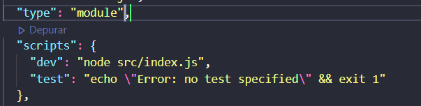
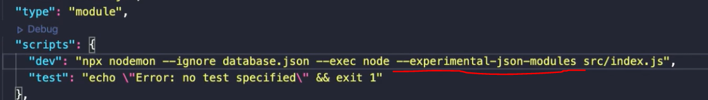

# javascript-life-cycle-study
I've developed this project by having the goal studing the Javascript life cycle. In that, I built a location translate system responsable by receiving data and write on console in table form, and storage in json file.

# Detalhes do projeto
Versão do node 14.3
## Sobre o estado atual ecma script modules
- Não há mais as funções require e require.resolve
- Não há mais a instância de module.export
- Não há mais acesso a variáveis globais como __dirname e __filename
- Não há como importar arquivos json diretamente

## Dependências
- node-draftlog
- chalk
- chalck-table
- nodemon

## observações do estudo
- Como não podemos importar diretamente o arquivo json precisamos modificar o arquivo package.json incluindo parâmetro type: module

- precisamos também incluir uma flag no script de dev chamada --experimental-json-modules

